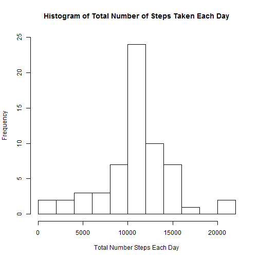

# Reproducible Research: Peer Assessment 1

Note that code assumes that the working directory is already set to the folder containing the cloned GitHut repository.

## Loading and preprocessing the data

### Load data
Unzip data if the data file "activity.cvs" is not in the repository directory cloned to desktop, then load and preprocess the data. 


```r
if(!"activity.csv" %in% list.files()) {
    unzip(paste(getwd(), "/activity.zip", sep = ""))
}
activityData <- read.csv("activity.csv")
```

### Process data
1. The "date" variable needs to be converted from a factor to a date class variable.
2. Given that the majority of analyzing this data only requires simple summary statistics and simple calculations, "melting" the data into a long/tall form--which is quite similar to its original form--that is easy to make various cuts of using "dcast" seems to be the optimal transformation to the data for this assignment. NA values are ignored by not including them in this dataset.


```r
activityData$date <- as.Date(activityData$date, "%Y-%m-%d")

library(reshape2)
activityMelted <- melt(activityData,
                       id.vars = c("date", "interval"),
                       measure.vars = "steps",
                       na.rm = TRUE)
```

## What is mean total number of steps taken per day?

Reshape the data using "cast" so each observation is a day and shows the total (sum) steps taken in that day.


```r
activityDayTotals <- dcast(activityMelted, date ~ variable, sum)
```

### Graphical illustration
Plot this dataset as a histogram of the total number of steps taken each day, figure shown below.


```r
hist(activityDayTotals$steps,
     breaks = 10,
     ylim = c(0,25),
     main = "Histogram of Total Number of Steps Taken Each Day",
     xlab = "Total Number Steps Each Day")
```

 

### Single values for "central" tendency
Calculate the mean and median steps taken each day.


```r
mean(activityDayTotals$steps)
```

```
## [1] 10766
```

```r
median(activityDayTotals$steps)
```

```
## [1] 10765
```

## What is the average daily activity pattern?

Reshape the data using "cast" so there is an observation for each 5-minute with the mean number of steps taken in each interval across all the days in the dataset.


```r
activityIntervalMeans <- dcast(activityMelted, interval ~ variable, mean)
```

Plot the mean steps taken in each 5-minute interval from dataset as a time series where time is the 5-minute intervals.


```r
library(ggplot2)
qplot(interval, steps, data = activityIntervalMeans,
      geom = "line",
      xlab = "5-Minute Intervals",
      ylab = "Mean Steps Across All Days",
      main = "Mean Steps in Each 5-Minute Interval Across All Days")
```

 

Determine which 5-minute interval contains the maximum number of average steps across all days. As the plot above shows, it should be between 5-minute intervals 750 and 1000 (which correspond to 7:50am and 10am, respectively)


```r
activityIntervalMeans$interval[activityIntervalMeans$steps %in% 
                                   max(activityIntervalMeans$steps)]
```

```
## [1] 835
```

This interval, 835, corresponds to 8:35am.

## Imputing missing values

Returning to the original dataset, the total number of NAs for each variable is shown below:


```r
colSums(is.na(activityData))
```

```
##    steps     date interval 
##     2304        0        0
```

As is shown above, only "steps" has NA values. The NAs are replaced with the mean number of steps taken for the 5-minute interval that has missing steps data. Specifically, the following steps are followed:

1. Merge the reshaped dataset, "activityIntervalMeans," from the section entitled "What is the average daily activity pattern?" with the original dataset.
2. Create a new "steps" variable that is equal to the "steps" variable in the original dataset, but replace any NAs with the mean steps variable for the given 5-minute interval from the "activityIntervalMeans" dataset.
3. "Melt" the new dataset because this again seems to be the optimal transformation to the data for this assignment.


```r
activityDataEstNAs <- merge(activityData, activityIntervalMeans,
                            by.x = "interval", by.y = "interval", all = FALSE)

activityDataEstNAs$steps <-  activityDataEstNAs$steps.x
activityDataEstNAs$steps[is.na(activityDataEstNAs$steps)] <-
    activityDataEstNAs$steps.y[is.na(activityDataEstNAs$steps)]

activityMeltedEstNAs <- melt(activityDataEstNAs,
                       id.vars = c("date", "interval"),
                       measure.vars = "steps")
```

Reshape the data using "cast" so each observation is a day and shows the total (sum) steps taken in that day.


```r
activityDayTotalsEstNAs <- dcast(activityMeltedEstNAs, date ~ variable, sum)
```

### Graphical illustration
Plot this dataset as a histogram of the total number of steps taken each day, figure shown below, and compare it to the first histogram which ignored NAs.


```r
hist(activityDayTotalsEstNAs$steps,
     breaks = 10,
     ylim = c(0,25),
     main = "Histogram of Total Number of Steps Taken Each Day",
     xlab = "Total Number Steps Each Day")
```

 

The only noticeable difference between the two histograms is that tallest bar in the first histogram is even taller in the second one. This makes sense because the mean total number of steps taken each day is calculated above and the tallest bar contains this value in the "bucket" of values in contains. So the strategy of replacing NAs with the mean steps taken in the given 5-minute interval will essentially reinforce the mean.

Further clarification on the above discussion:
If one were to investigate further (code note reported), they would find that NAs don't appear in days with data (i.e. a day is either all NAs or has no NAs). So the NA replacement strategy used above just adds whole days that clone of the mean day, which has the mean total number of steps in a day as calculated and mentioned above.

### Single values for "central" tendency
Calculate the mean and median steps taken each day.


```r
mean(activityDayTotalsEstNAs$steps)
```

```
## [1] 10766
```

```r
median(activityDayTotalsEstNAs$steps)
```

```
## [1] 10766
```

As per the discussion above about the comparison of the histograms, it is not surprising that the mean does change because adding the mean value of a variable to the same variable does not change the mean. It is also not very surprising that the median now takes the same value as the mean because several clone of the mean were added to the variable and that increases the chance that the mean is also the median (middle) value in the variable.

## Are there differences in activity patterns between weekdays and weekends?

Create a new factor variable showing if the date is either a "weekend" or "weekday." This is done using the following steps:

1. Create a logical vector that equals "TRUE" if it is a Saturday or Sunday
2. Create a variable, "dayOfTheWeek," using the above logical vector that takes the value of either "weekend" or "weekday"
3. Transform "dayOfTheWeek" into a factor


```r
weekEnd <- grepl( "Saturday|Sunday", weekdays(activityMeltedEstNAs$date))

activityMeltedEstNAs$dayOfTheWeek[weekEnd] <- "Weekend"
activityMeltedEstNAs$dayOfTheWeek[!weekEnd] <- "Weekday"

activityMeltedEstNAs$dayOfTheWeek <-
    as.factor(activityMeltedEstNAs$dayOfTheWeek)
```

Reshape the data with the new "dayOfTheWeek" variable using "cast" so there is an observation for each 5-minute with the mean number of steps taken in each interval across all weekend and weekdays in the dataset. Then plot this dataset as a time series with Weekend and Weekdays as separate panels in the plot.


```r
activityIntervalMeansEstNAs <- dcast(activityMeltedEstNAs, interval +
                                         dayOfTheWeek ~ variable, mean)

qplot(interval, steps, data = activityIntervalMeansEstNAs,
      facets = dayOfTheWeek ~ .,
      geom = "line",
      xlab = "5-Minute Intervals",
      ylab = "Mean Steps Across All Days",
      main = "Mean Steps in Each 5-Minute Interval Across All Days")
```

 

As the plot above shows, there are some interesting differences between the mean weekend and weekday.
* Activity (as measured with steps) picks up quickly on weekdays and more gradually on weekends.
* Weekdays have a large spike in activity while weekends don't have one large spike.
* Weekdays have a quicker drop of in activity at the end of the "active" day.
* Given the relatively lower level of activity in the middle of the day (10am to 5pm) on weekdays compared to weekends, it seems unlikely this data is from someone who does much manual labor during weekdays.
